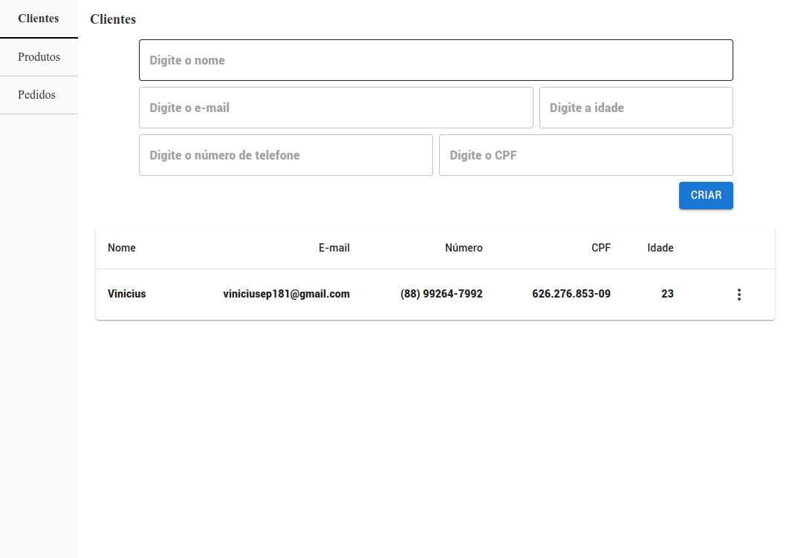
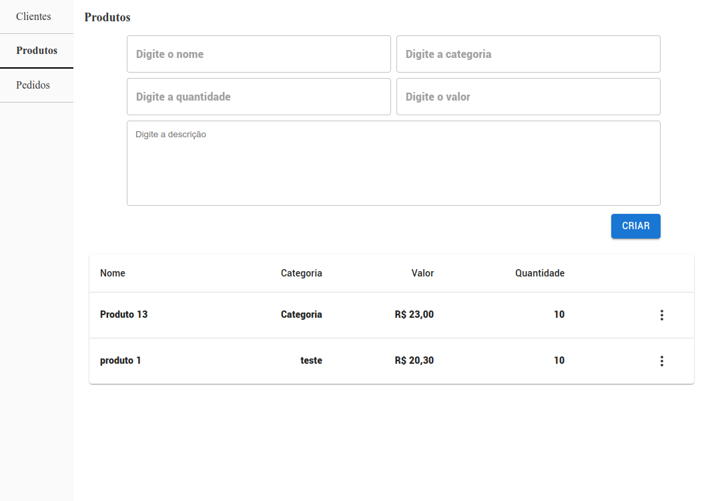

## CRUD de produtos, clientes e pedidos

Esse projeto foi feito para a etapa de teste técnico no processo seletivo de Desenvolvedor Web


Página de clientes


Página de produtos


Página de pedidos

### Pré-requisitos

[NodeJs](https://nodejs.org/pt)

Como executar

- Clonar esse repositório e abri-lo.
- Executar os seguintes comandos, sem sequência.

```bash
    ## Vai instalar todas as dependências do projeto
    npm i

    ## Vai executar o projeto web, junto com o servidor
    npm start
```

### Principais tecnologias usadas
- ReactJS
- React router dom
- Material UI
- Material Icong
